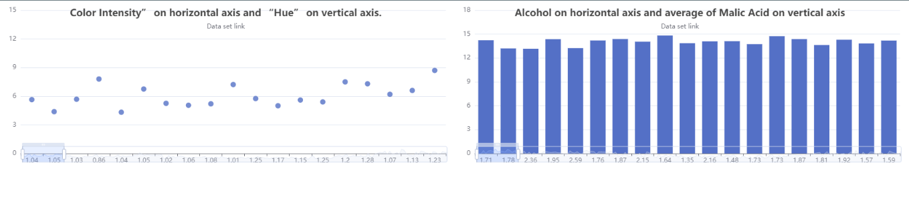

### Data Visualization

#### Command
```
yarn install
```

#### Optional Command

```
npm install --save echarts-for-react

# `echarts` is the peerDependence of `echarts-for-react`, you can install echarts with your own version.

npm install --save echarts
```

#### Run Server Command
```
yarn run start
```

####    Dataset Link
```
https://archive.ics.uci.edu/ml/datasets/wine
```

####    Chart Preview
</img>
#### All rights reserved by <a href='hasibul-hasan.netlify.com'>Hasibul Hasan<a>